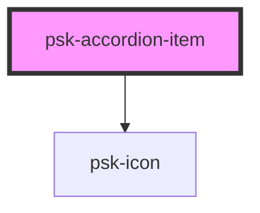

# psk-accordion-item

<!-- Auto Generated Below -->

## Properties

| Property | Attribute | Description | Type      | Default     |
| -------- | --------- | ----------- | --------- | ----------- |
| `layout` | `layout`  |             | `string`  | `'default'` |
| `opened` | `opened`  |             | `boolean` | `false`     |
| `title`  | `title`   |             | `string`  | `''`        |

## Dependencies

### Depends on

- [psk-icon](../../psk-icon)

### Graph

----------------------------------------------

*Made by [WebCardinal](https://github.com/webcardinal) contributors.*
