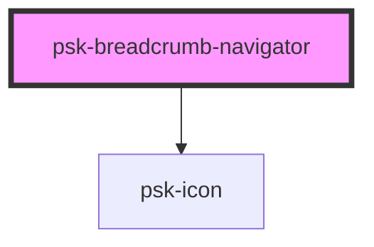

# psk-breadcrumb-navigator

<!-- Auto Generated Below -->

## Properties

| Property    | Attribute    | Description | Type                  | Default                                 |
| ----------- | ------------ | ----------- | --------------------- | --------------------------------------- |
| `eventName` | `event-name` |             | `string`              | `BREADCRUMB_CONSTANTS.BREADCRUMB_CLICK` |
| `segments`  | --           |             | `BreadcrumbSegment[]` | `[]`                                    |

## Dependencies

### Depends on

- [psk-icon](../psk-icon)

### Graph

----------------------------------------------

*Made by [WebCardinal](https://github.com/webcardinal) contributors.*
