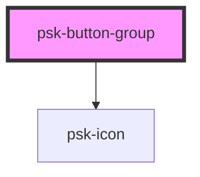

# psk-button-group

<!-- Auto Generated Below -->

## Properties

| Property    | Attribute    | Description | Type      | Default     |
| ----------- | ------------ | ----------- | --------- | ----------- |
| `classes`   | `classes`    |             | `string`  | `''`        |
| `icon`      | `icon`       |             | `string`  | `undefined` |
| `iconColor` | `icon-color` |             | `string`  | `undefined` |
| `label`     | `label`      |             | `string`  | `undefined` |
| `opened`    | `opened`     |             | `boolean` | `false`     |

## Dependencies

### Depends on

- [psk-icon](../psk-icon)

### Graph

----------------------------------------------

*Made by [WebCardinal](https://github.com/webcardinal) contributors.*
