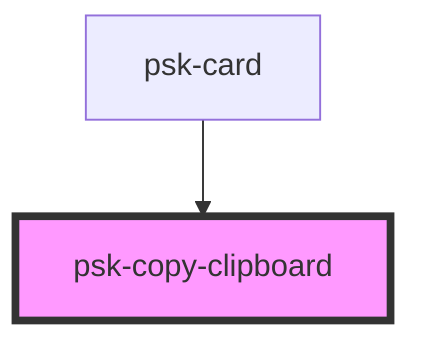

# psk-copy-clipboard

<!-- Auto Generated Below -->

## Properties

| Property | Attribute | Description | Type     | Default |
| -------- | --------- | ----------- | -------- | ------- |
| `id`     | `id`      |             | `string` | `""`    |

## Events

| Event            | Description | Type               |
| ---------------- | ----------- | ------------------ |
| `getHistoryType` |             | `CustomEvent<any>` |

## Dependencies

### Used by

 - [psk-card](../psk-card)

### Graph

----------------------------------------------

*Made by [WebCardinal](https://github.com/webcardinal) contributors.*
