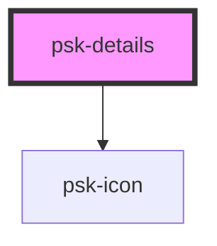

# psk-details

<!-- Auto Generated Below -->

## Properties

| Property          | Attribute          | Description | Type      | Default     |
| ----------------- | ------------------ | ----------- | --------- | ----------- |
| `eventData`       | `event-data`       |             | `any`     | `undefined` |
| `eventDispatcher` | `event-dispatcher` |             | `string`  | `undefined` |
| `eventName`       | `event-name`       |             | `string`  | `undefined` |
| `layout`          | `layout`           |             | `string`  | `'default'` |
| `opened`          | `opened`           |             | `boolean` | `false`     |
| `title`           | `title`            |             | `string`  | `''`        |

## Dependencies

### Depends on

- [psk-icon](../psk-icon)

### Graph

----------------------------------------------

*Made by [WebCardinal](https://github.com/webcardinal) contributors.*
