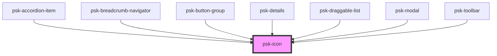

# psk-icon

<!-- Auto Generated Below -->

## Properties

| Property       | Attribute       | Description | Type      | Default     |
| -------------- | --------------- | ----------- | --------- | ----------- |
| `classes`      | `classes`       |             | `string`  | `undefined` |
| `color`        | `color`         |             | `string`  | `undefined` |
| `disableColor` | `disable-color` |             | `boolean` | `false`     |
| `icon`         | `icon`          |             | `string`  | `undefined` |

## Dependencies

### Used by

 - [psk-accordion-item](../psk-accordion/psk-accordion-item)
 - [psk-breadcrumb-navigator](../psk-breadcrumb-navigator)
 - [psk-button-group](../psk-button-group)
 - [psk-details](../psk-details)
 - [psk-draggable-list](../psk-draggable-list)
 - [psk-modal](../psk-modal)
 - [psk-toolbar](../psk-toolbar)

### Graph

----------------------------------------------

*Made by [WebCardinal](https://github.com/webcardinal) contributors.*
