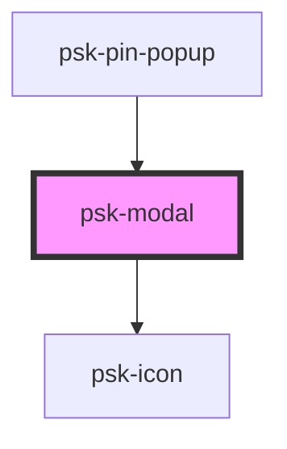

# psk-modal

<!-- Auto Generated Below -->

## Properties

| Property    | Attribute    | Description | Type      | Default     |
| ----------- | ------------ | ----------- | --------- | ----------- |
| `eventName` | `event-name` |             | `string`  | `undefined` |
| `expanded`  | `expanded`   |             | `boolean` | `false`     |
| `opened`    | `opened`     |             | `boolean` | `false`     |

## Events

| Event        | Description | Type               |
| ------------ | ----------- | ------------------ |
| `closeModal` |             | `CustomEvent<any>` |

## Dependencies

### Used by

 - [psk-pin-popup](../psk-pin-popup)

### Depends on

- [psk-icon](../psk-icon)

### Graph

----------------------------------------------

*Made by [WebCardinal](https://github.com/webcardinal) contributors.*
