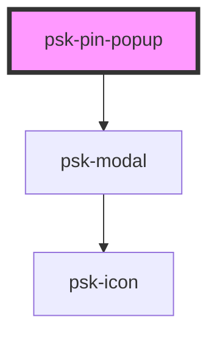

# psk-pin-popup

<!-- Auto Generated Below -->

## Properties

| Property | Attribute | Description | Type      | Default |
| -------- | --------- | ----------- | --------- | ------- |
| `opened` | `opened`  |             | `boolean` | `false` |

## Events

| Event     | Description | Type               |
| --------- | ----------- | ------------------ |
| `sendPin` |             | `CustomEvent<any>` |

## Dependencies

### Depends on

- [psk-modal](../psk-modal)

### Graph

----------------------------------------------

*Made by [WebCardinal](https://github.com/webcardinal) contributors.*
