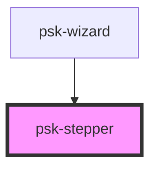

# psk-stepper

<!-- Auto Generated Below -->

## Properties

| Property           | Attribute          | Description | Type           | Default                  |
| ------------------ | ------------------ | ----------- | -------------- | ------------------------ |
| `activeStep`       | --                 |             | `WizardStep`   | `undefined`              |
| `componentRender`  | `component-render` |             | `string`       | `"psk-stepper-renderer"` |
| `handleStepChange` | --                 |             | `Function`     | `undefined`              |
| `wizardSteps`      | --                 |             | `WizardStep[]` | `undefined`              |

## Dependencies

### Used by

 - [psk-wizard](../psk-wizard)

### Graph

----------------------------------------------

*Made by [WebCardinal](https://github.com/webcardinal) contributors.*
