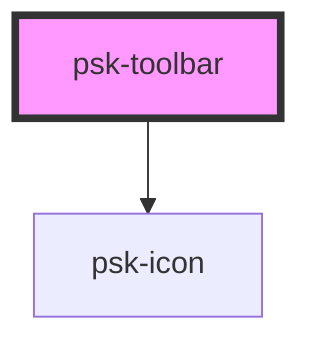

# psk-toolbar

<!-- Auto Generated Below -->

## Properties

| Property    | Attribute    | Description | Type      | Default     |
| ----------- | ------------ | ----------- | --------- | ----------- |
| `actions`   | `actions`    |             | `string`  | `undefined` |
| `eventData` | `event-data` |             | `string`  | `undefined` |
| `icons`     | `icons`      |             | `boolean` | `false`     |

## Dependencies

### Depends on

- [psk-icon](../psk-icon)

### Graph

----------------------------------------------

*Made by [WebCardinal](https://github.com/webcardinal) contributors.*
