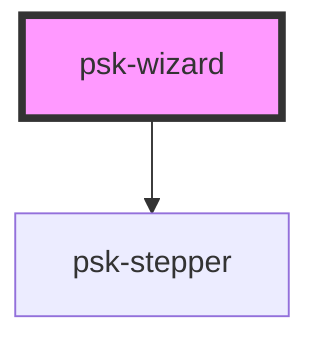

# psk-wizard

<!-- Auto Generated Below -->

## Properties

| Property          | Attribute          | Description | Type           | Default     |
| ----------------- | ------------------ | ----------- | -------------- | ----------- |
| `componentRender` | `component-render` |             | `string`       | `undefined` |
| `wizardSteps`     | --                 |             | `WizardStep[]` | `undefined` |

## Events

| Event                     | Description | Type               |
| ------------------------- | ----------- | ------------------ |
| `changeStep`              |             | `CustomEvent<any>` |
| `finishWizard`            |             | `CustomEvent<any>` |
| `needWizardConfiguration` |             | `CustomEvent<any>` |

## Dependencies

### Depends on

- [psk-stepper](../psk-stepper)

### Graph

----------------------------------------------

*Made by [WebCardinal](https://github.com/webcardinal) contributors.*
